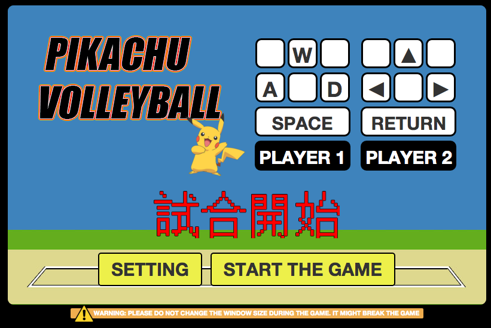

#  Pikachu Volleyball

**Pikachu Volleyball** is a classic Japanese multiplayer game that was around more than a decade ago at a time when the the world was still using floppy disk to store the game and pass around. It was an .exe and has only been available on Window OS sadly.

This is a remake of the game with JavaScript/HTML/CSS in browser environment.

Pikachu can jump, spike, move around freely.

## THE GAME
Three orientations are invovled: initialize, game page, restart page

* INITALIZE: Player can hover on the key to get info on controls

* GAME: Player can jump with the corresponding control jump up key

* RESTART: GAME prompt for restart when maximum point is reached

### Rules
Classic play: https://www.youtube.com/watch?v=zNlSun_gL68

### Controls
Player 1 [LEFT] on W/A/D/SPACE
Player 2 [RIGHT] on UP/LEFT/RIGHT/RETURN

* W / UP : to JUMP
* A / LEFT : to move left
* D / RIGHT : to move right
* SPACE / RETURN : to SPIKE the ball

### Limitation
WARNING: PLEASE DO NOT CHANGE THE WINDOW SIZE DURING THE GAME. IT MIGHT BREAK THE GAME

## Development
Whilst the original version includes variable on bonus spike momentum with key event, this remake version excluded that from the current edition.

## Credits
jBeep [for JS audio plugin]: https://code.google.com/p/jbeep/

URL: https://wdi-hk-9.github.io/Pikachu-Volleyball